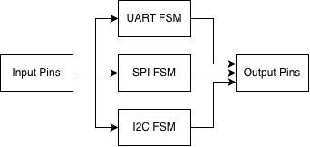
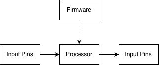

# Architectural Challenge

The goal is to build a **programmable protocol emulator**: a small processor whose firmware can implement protocols such as UART, SPI, and I2C through precise GPIO manipulation and timing.

## The Naive Approach: Dedicated FSMs

A straightforward implementation is to build a dedicated RTL FSM for each protocol:

* UART FSM
* SPI FSM
* I2C FSM
* ...

Each FSM directly controls the relevant GPIOs and implements the protocol's state transitions.



This works, but every new protocol requires new hardware.

## The Protocol Emulator

Instead, move the protocol state machines from hardware into **firmware**.

Build a small CPU with:

* GPIO inputs/outputs
* Program/instruction memory
* Registers / datapath
* Precise cycle timing
* Control-flow instructions



The firmware then describes the protocol behaviour.

For example, an I2C transmission can be expressed as:

```text
START
SEND ADDRESS
READ ACK
SEND DATA
READ ACK
STOP
```

The CPU executes these operations by manipulating GPIOs and waiting precise numbers of cycles.

## Core Architectural Question

> **What is the minimal instruction set and datapath capable of expressing arbitrary protocol behaviour while providing precise GPIO control and timing?**

The design should provide enough primitives for:

* **Control flow** — loops and conditional branches
* **GPIO** — read, write, and release pins
* **Timing** — deterministic cycle delays
* **Bit manipulation** — shifting and moving protocol data
* **Counters** — repeated operations and timing loops

The challenge is to find the smallest, most efficient hardware architecture that provides these capabilities.
